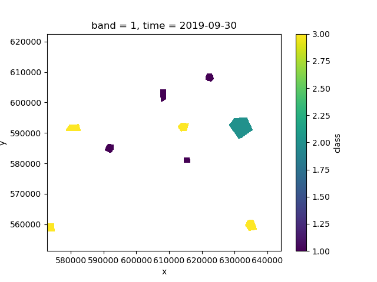
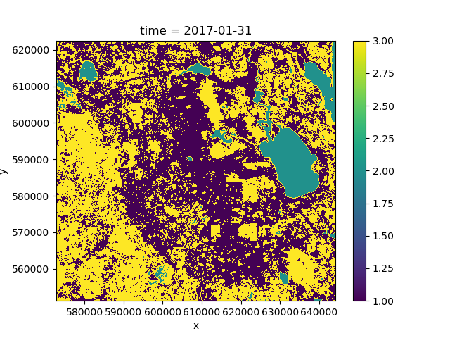
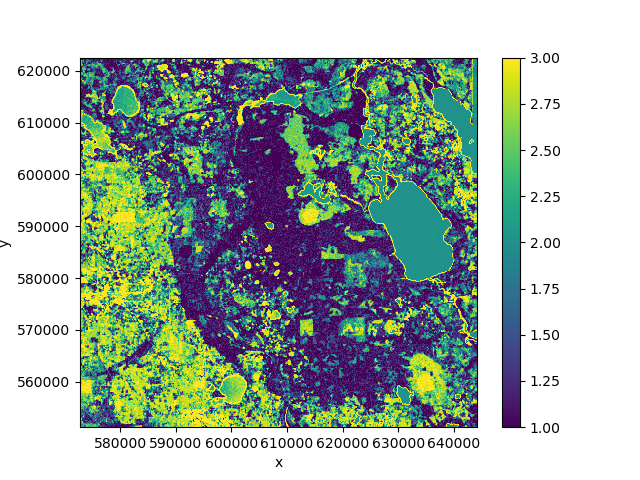
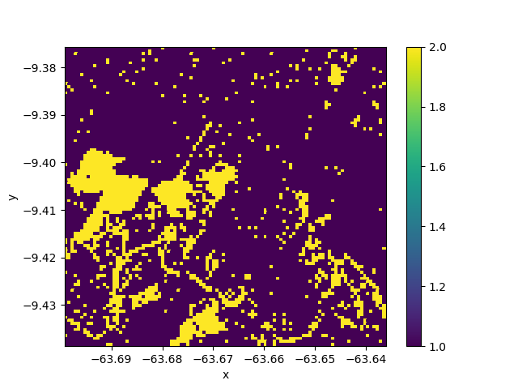

.. _classify:

==============
Classification
==============

``nd`` provides a wrapper for ``scikit-learn`` classifiers that can be directly trained on and
applied to ``xarray`` Datasets.

Training a classifier
---------------------

First, we need to get some training data. We will do a forest/non-forest classification
using some polygon training data, which we can rasterize to match the dataset::

    >>> import nd
    >>> from nd.classify import Classifier
    >>> from sklearn.ensemble import RandomForestClassifier
    >>> path = '../data/C2.nc'
    >>> ds = nd.open_dataset(path)
    >>> labels = nd.vector.rasterize('../data/labels.shp', ds)['class'].squeeze()
    >>> labels.plot()

If we investigate ``labels``, we see that it has an associated legend
to match the integer classes::

    >>> labels
    <xarray.DataArray 'class' (y: 100, x: 100)>
    array([[0, 0, 0, ..., 0, 0, 0],
           [0, 0, 0, ..., 0, 0, 0],
           [0, 0, 0, ..., 0, 0, 0],
           ...,
           [0, 0, 0, ..., 0, 0, 0],
           [0, 0, 0, ..., 0, 0, 0],
           [0, 0, 0, ..., 0, 0, 0]])
    Coordinates:
      * y        (y) float64 -9.376 -9.377 -9.377 -9.378 ... -9.437 -9.438 -9.438
      * x        (x) float64 -63.7 -63.7 -63.7 -63.7 ... -63.64 -63.64 -63.64 -63.64
        time     datetime64[ns] 2019-09-12
    Attributes:
        legend:   [(0, None), (1, 'forest'), (2, 'nonforest')]

::

    >>> clf = Classifier(RandomForestClassifier(n_estimators=10))
    >>> pred = clf.fit(ds, labels).predict(ds)
    >>> pred.isel(time=0).plot()

If we plot the mean of the predicted class over time we can see that the predictions
change because the forest cover changes over the course of the time period::

    >>> pred.mean('time').plot()

Feature and data dimensions
---------------------------

Internally, the entire dataset needs to be converted to a two-dimensional array
to work with most classification algorithm in ``scikit-learn``.

The first dimension (rows) corresponds to independent data points,
whereas the second dimension (columns) corresponds to the features (attributes, variables)
of that data point.

By default, ``nd`` will flatten all dataset dimensions into the rows of the array,
and convert the data variables into the columns of the array.

However, :class:`nd.classify.Classifier` has an additional keyword argument ``feature_dims``
that controls which dimensions are considered to be features of the data.
Typically, this could be a ``band`` dimension, which really isn't a dimensions but
a set of features (or variables) of the data. It could also be the ``time`` dimension,
in which case all time steps are treated as additional information about a point, rather than
separate points in the feature space.

Example::

    >>> clf = Classifier(RandomForestClassifier(n_estimators=10),
    ...                  feature_dims=['time'])
    >>> pred = clf.fit(ds, labels).predict(ds)
    >>> pred.plot()

Our prediction output no longer has a ``time`` dimension because it was converted into
a feature dimension and used for prediction. In this case the result is not great because
the classes change over time and we thus have noisy training data.

.. topic:: See Also:

 * :mod:`nd.classify`
 * `<https://scikit-learn.org/>`_
