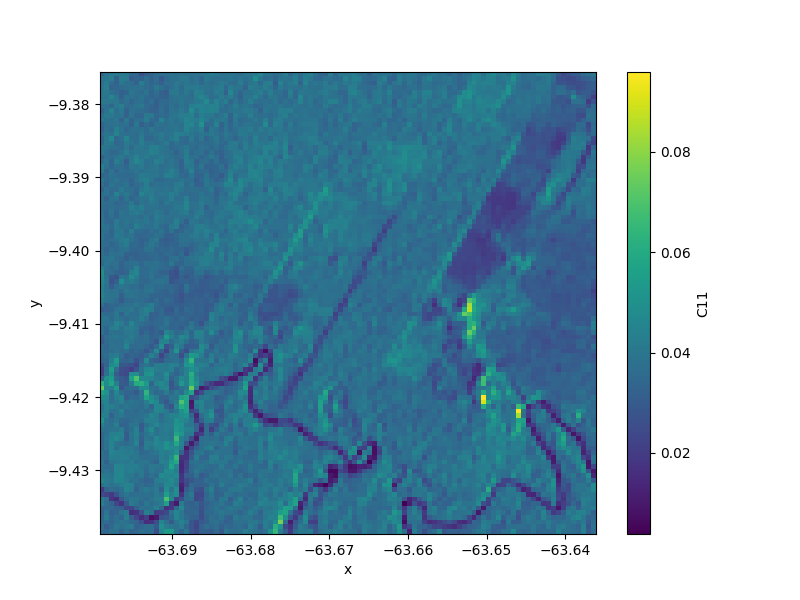
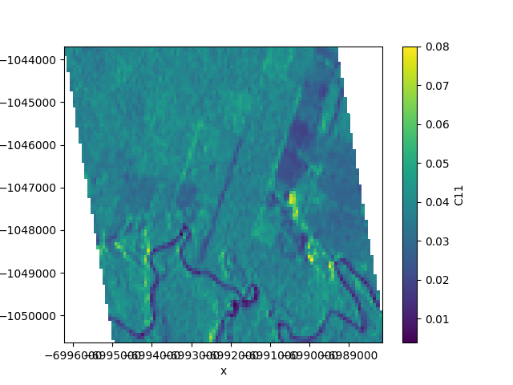

.. _projections:

===========
Projections
===========

``nd`` handles geographic projections with ``rasterio``.
Projection information is usually stored in the metadata attributes ``crs`` and ``transform``, but different standards exist.

All functionality related to coordinate systems and projections is contained in the module :mod:`nd.warp`.
You can extract the coordinate reference system of a dataset using :meth:`nd.warp.get_crs`::

    >>> from nd.warp import get_crs
    >>> get_crs(ds)
    CRS({'proj': 'longlat', 'ellps': 'WGS84', 'no_defs': True})

The returned object is always of type ``rasterio.crs.CRS``.

Similarly, the coordinate transformation can be extracted using :meth:`nd.warp.get_transform`::

    >>> from nd.warp import get_transform
    >>> get_transform(ds)
    Affine(0.00012639344994691423, 0.0, -63.799961134106155,
           0.0, 0.00012639212357809862, -9.30010580901427)

which is an ``affine.Affine`` object and represents the mapping from image coordinates to projection coordinates.

Additionally, a dataset contains the coordinates of the x and y axes in ``ds.coords['x']`` and ``ds.coords['y']``.
The transform object and the coordinate arrays represent the same information.

Reprojecting to a different CRS
-------------------------------
You can reproject your dataset to a different coordinate system using :class:`nd.warp.Reprojection`. For example, the following code will reproject your dataset into Web Mercator (EPSG:3857)::

    >>> from nd.warp import Reprojection, get_crs
    >>> get_crs(ds)
    CRS({'proj': 'longlat', 'ellps': 'WGS84', 'no_defs': True})
    >>> proj = Reprojection(crs='EPSG:3857')
    >>> ds_reprojected = proj.apply(ds)
    >>> get_crs(ds_reprojected)
    ...

::

    >>> from nd.io import open_dataset
    >>> ds = open_dataset('data/C2.nc')
    >>> ds.C11.mean('time').plot(size=6)

::

    >>> from nd.warp import Reprojection
    >>> goode = Reprojection(crs='+proj=goode +ellps=sphere +datum=wgs84')
    >>> proj = goode.apply(ds)
    >>> proj.C11.mean('time').plot()

``Reprojection()`` lets you specify many more options, such as the desired extent and resolution.

When reprojecting a dataset this way, ``nd`` will also add coordinate arrays ``lat`` and ``lon`` to the result which contains the latitude and longitude values at a number of tie points, irrespective of the projection. Storing these arrays alongside the projection information allows GIS software to correctly display the data.

.. topic:: See Also:

 * :mod:`nd.warp`
 * `<https://rasterio.readthedocs.io/en/latest/topics/georeferencing.html>`_
 * `<https://rasterio.readthedocs.io/en/latest/topics/reproject.html>`_
