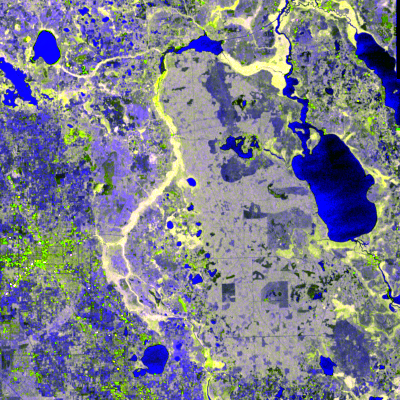
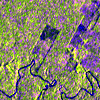

.. _visualize:

==================
Data Visualization
==================

When you want to plot a single variable for a single time slice, ``xarray``'s `built-in plotting methods <http://xarray.pydata.org/en/stable/plotting.html>`_ are more than sufficient.
``nd`` provides a few extra methods for visualizing multi-temporal and multivariate datasets.

Creating RGB composites from multivariate data
----------------------------------------------

::

    >>> from nd.io import open_dataset
    >>> from nd.visualize import to_rgb
    >>> ds = open_dataset('data/C2.nc')
    >>> t0 = ds.isel(time=0)
    >>> rgb = to_rgb([t0.C11, t0.C22, t0.C11 / t0.C22], 'images/c2_rgb.png')

Creating video from time series data
------------------------------------
The example writes to a gif image so it can be embedded here, but many video formats are supported.

::

    >>> from nd.visualize import write_video
    >>> write_video(ds, 'images/c2.gif', fps=5, timestamp=False)

.. topic:: See Also:

 * `<http://xarray.pydata.org/en/stable/plotting.html>`_
